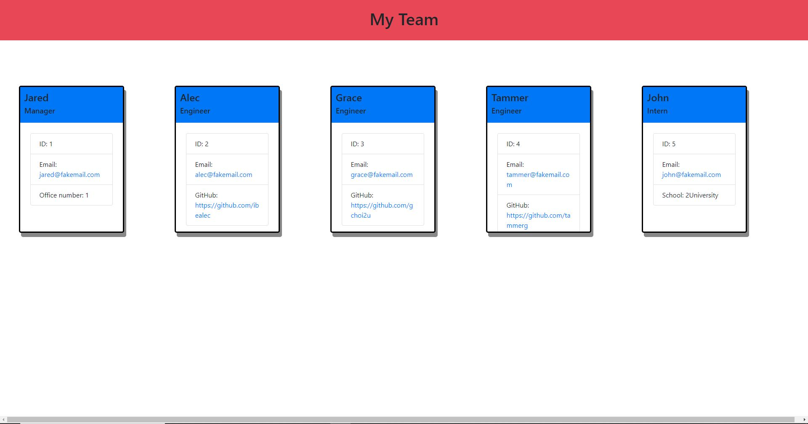

# Team-Profile-Generator

## Task of this assignment

Your task is to build a Node.js command-line application that takes in information about employees on a software engineering team, then generates an HTML webpage that displays summaries for each person. Testing is key to making code maintainable, so you’ll also write a unit test for every part of your code and ensure that it passes each test.

## Screenshot

## Links

Deployed: https://github.com/fongvang09/Team-Profile-Generator/settings

GitHub: https://github.com/fongvang09/Team-Profile-Generator/settings

Screencastify: https://drive.google.com/file/d/1aCiN-ZXLZ-dTYPQZaIGP6DSQH_rxgfyn/view
